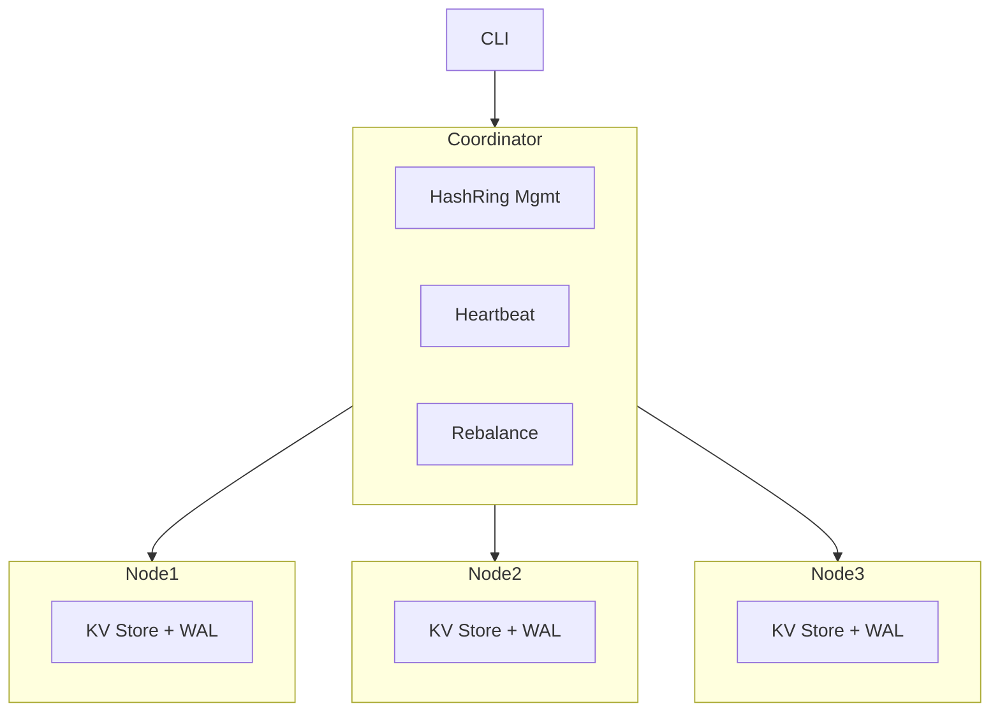

# Distributed KV Store – Design Document

## 1. Overview

This project implements a **distributed key-value store** in C++ that demonstrates the fundamental design principles of systems like **DynamoDB, Cassandra, and Redis Cluster**. The system is built to illustrate:

* **Consistent Hashing** for balanced key distribution.
* **Coordinator** managing metadata and routing.
* **Node servers** storing actual key-value data.
* **Replication** for redundancy.
* **Persistence** using a **Write-Ahead Log (WAL)** with compaction.
* **Fault tolerance** with heartbeats and rebalance.
* **CLI interface** for interactive testing.

This project is designed primarily for **educational purposes**, simulating the challenges of distributed systems: partitioning, replication, consistency, and fault recovery.

---

## 2. Architecture

The system is composed of three core components:

### 2.1 Coordinator

* Maintains the **hash ring** (via `HashRing`).
* Tracks active nodes and their status (UP/DOWN).
* Handles **client requests** (via CLI) and routes them to appropriate nodes.
* Supports **replication factor** configuration (`setreplica <N>`).
* Periodically performs **heartbeat checks**.
* Provides **rebalance** functionality to redistribute keys after topology changes.

### 2.2 Node Servers

* Each node is a standalone server process (`node_server.cpp`).
* Stores key-value pairs in memory (`unordered_map`).
* Provides JSON-RPC operations: `put`, `get`, `del`, `size`, `dump`.
* Persists updates with **WAL** (append-only `data.log`).
* On restart, replays WAL to restore state.
* Performs **log compaction** periodically to prevent unbounded growth.

### 2.3 Hash Ring

* Implements **consistent hashing** with virtual nodes.
* Responsible for mapping keys → nodes.
* Supports `get_node` (single target) and `get_nodes` (N replicas).

### 2.4 System Architecture Diagram



---

## 3. Data Model

* **Key**: string
* **Value**: string
* Stored as `unordered_map<string,string>` in each node.
* Data is partitioned across nodes by consistent hashing.
* Replication ensures multiple nodes hold the same key.

---

## 4. Replication & Consistency

* Default replication factor: **1**.
* User can configure via CLI: `setreplica <N>`.
* `Coordinator::put` writes the key to N distinct nodes.
* `Coordinator::get` attempts reads in order until success.
* `Coordinator::del` deletes from all replicas.
* **Consistency Model**: Primary-Preferred + Best-Effort Replication.

  * Not strict quorum.
  * Prioritizes availability over strong consistency.

---

## 5. Persistence

### 5.1 WAL (Write-Ahead Log)

* Every operation (`put`, `del`) is appended to `data.log`.
* Format:

  ```
  PUT <key> <value>
  DEL <key>
  ```
* On restart, the node **replays the log** to reconstruct the in-memory store.

### 5.2 Compaction

* To prevent `data.log` from growing indefinitely, nodes perform **compaction**:

  * After **N operations** (default: 100).
  * Rewrite `data.log` with the current snapshot of the store.
* Ensures efficient recovery and stable disk usage.

---

## 6. Fault Tolerance

### 6.1 Heartbeat

* Coordinator spawns a background thread.
* Periodically sends `size` RPC to all nodes.
* Updates `node_status` (UP/DOWN).

### 6.2 Rebalance

* Triggered manually via CLI (`rebalance`).
* Coordinator collects all keys from all nodes via `dump`.
* For each key:

  1. Determine correct replica set via `get_nodes`.
  2. Copy the key to missing nodes.
  3. Remove from incorrect nodes.
* Logs actions (`Copied`, `Removed`).

---

## 7. CLI Interface

The CLI (`main.cpp`) provides commands:

| Command               | Description                                               |
| --------------------- | --------------------------------------------------------- |
| `addnode <id> <port>` | Add a new storage node                                    |
| `removenode <id>`     | Remove a node from cluster                                |
| `put <k> <v>`         | Insert/Update a key-value pair                            |
| `get <k>`             | Retrieve value                                            |
| `del <k>`             | Delete key                                                |
| `setreplica <N>`      | Configure replication factor                              |
| `rebalance`           | Redistribute keys after topology change                   |
| `show`                | List active nodes with status and key count               |
| `stats`               | Print global stats (nodes, total keys, avg keys per node) |
| `exit`                | Terminate CLI                                             |

---

## 8. Workflow Examples

### 8.1 Put with Replication

```txt
> setreplica 2
> put apple 123
Replicas for key apple: n1 n2
[n1] PUT apple = 123 -> {"status":"ok"}
[n2] PUT apple = 123 -> {"status":"ok"}
```

### 8.2 Get with Fallback

```txt
> get apple
apple -> 123
# If n1 is DOWN, coordinator tries n2.
```

### 8.3 Rebalance After Adding Node

```txt
> addnode n3 5003
Rebalancing after adding node n3...
> rebalance
[Coordinator] Starting rebalance...
[Rebalance] Copied key 'apple' to n3
[Rebalance] Removed key 'banana' from n1
[Coordinator] Rebalance complete.
```

---

## 9. Future Work

* **Quorum Reads/Writes**: Ensure `R + W > N` consistency.
* **Leader Election (Raft)** for coordination.
* **Automatic Failover** after node crash.
* **HTTP / gRPC API** for external clients.
* **Benchmarking Tool** for throughput/latency measurement.
* **Visualization** of hash ring and key distribution.
* **Containerization**: Docker + docker-compose for easy deployment.

---

## 10. Conclusion

This distributed KV store demonstrates the building blocks of real-world distributed databases:

* Partitioning with consistent hashing.
* Replication and redundancy.
* Fault detection and rebalancing.
* Persistence via WAL and compaction.

While simplified, it provides a solid foundation for extending into production-grade features like consensus protocols, distributed transactions, and large-scale deployments.
